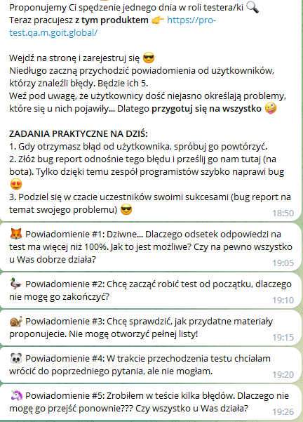
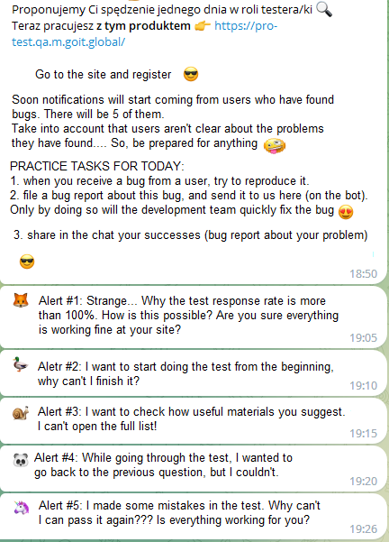
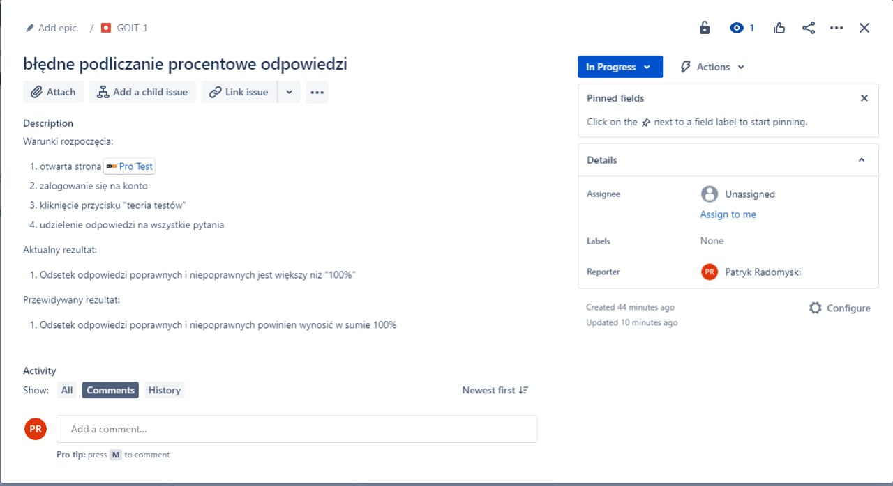
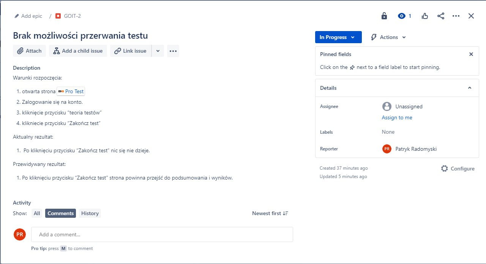
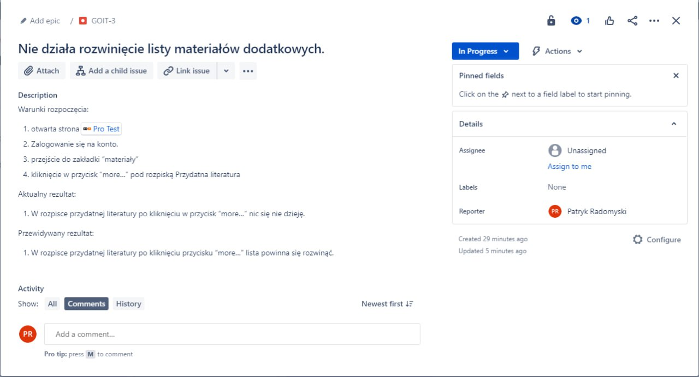
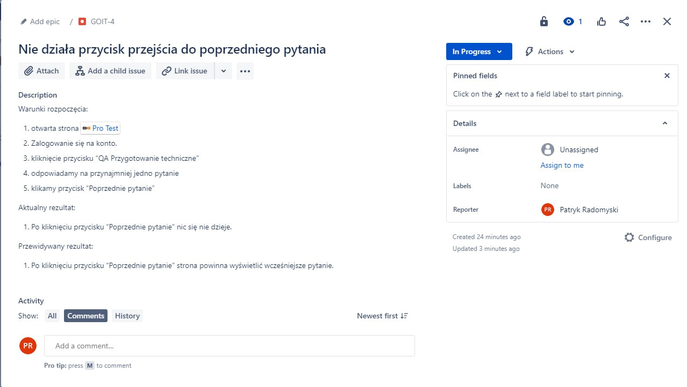
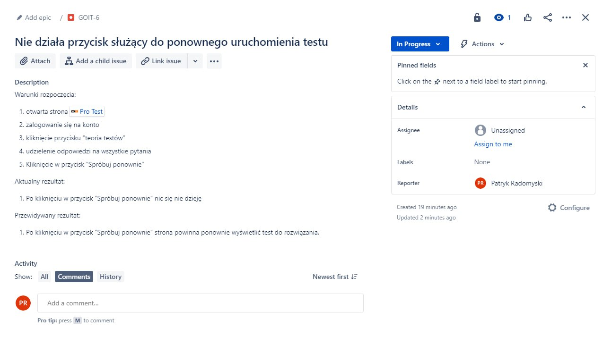

<h1 align="center">MY First Project</h1> 

<b>Description:</b> In this project, I was testing a web application. I got 5 reports that imitated bugs found by customers. My task was to recreate these bugs, and write a Bug report in Jira.

<tt>NOTE: Please bear in mind that this was my first step as a tester. I was just learning how to write Test cases and Bug reports, so that's why I was using my native language. Now I'm confident in writing TC & BR, So I'm using English in all my work. If You want to check my Test cases and Bug reports in English, please press right the icon on my Profile 😉</tt>
                                                                                                                                                                                                                                                       
 <h2>Task Content and Translation:</h2>                                                                                                                                                                                                                                                     

  

 <h3>Answer to the first alert</h3>
 
 
TRANSLATION: 

 
Summary: Incorrectly calculating the percentage of answers

 
Pre-conditions:

  
 
1. Website "PRO Test" must be opened

 
2. Log-in to your account

 
3. press the "teoria testów" button

 
4. Answer all questions

  
 
Actual result:

 
percentage of correct and incorrect answers is greater than 100%

  
 
Expected result:

 
percentage of correct and incorrect answers should be exactly 100%

  
 <h3>Answer to the second alert</h3>
 
  
TRANSLATION: 

 
Summary: Incorrectly calculating the percentage of answers

 
Pre-conditions:

  
 
1. Website "PRO Test" must be opened

 
2. Log-in to your account

 
3. press the "teoria testów" button

 
4. press the "Zakończ test" button

  
 
Actual result:

 
Nothing happens

  
 
Expected result:

 
Page should change to summary and results

  
 <h3>Answer to the third alert</h3>
 

TRANSLATION: 

 
Summary: Expansion of the list of additional materials does not work

 
Pre-conditions:

  
 
1. Website "PRO Test" must be opened

 
2. Log-in to your account

 
3. Go to the "materiały" tab.

 
4. press the "more" button under Przydatna literatura

  
 
Actual result:

 
Nothing happens

  
 
Expected result:

 
The list should expand

  
  <h3>Answer to the fourth alert</h3>
 

TRANSLATION: 

 
Summary: go to the previous question button didn't work

 
Pre-conditions:

  
 
1. Website "PRO Test" must be opened

 
2. Log-in to your account

 
3. Press the "QA przygotowanie techniczne" button

 
4. Answer at least one question

 
5. Press the "poprzednie pytanie" button

  
 
Actual result:

 
Nothing happens

  
 
Expected result:

 
Page should go back to the previous question

  
 <h3>Answer to the fifth alert</h3>
 

TRANSLATION: 

 
Summary: test restart button didn't work

 
Pre-conditions:

  
 
1. Website "PRO Test" must be opened

 
2. Log-in to your account

 
3. Press the "teoria testów" button

 
4. Answer all questions

 
5. Press the "Spróbuj ponownie" button

  
 
Actual result:

 
Nothing happens

  
 
Expected result:

 
Page should run the test again

 
<h1 align="center">Thanks for checking my first project. I know what you may think, but let me answer with a meme...</h1>

